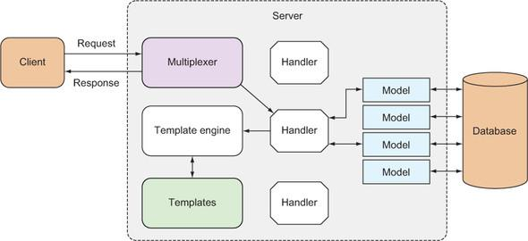

# Capítulo 2. Go ChitChat

Este capítulo abrange

- Apresentando a programação web Go
- Projetando um aplicativo web Go típico
- Escrevendo uma aplicação web Go completa
- Compreendendo as partes de um aplicativo web Go

No final do capítulo 1 , passamos pelo aplicativo web Go mais simples possível. Esse aplicativo web simples, admito, é bem inútil e nada mais é do que o equivalente a um aplicativo Hello World. Neste capítulo, exploraremos outro aplicativo web básico, mas mais útil. Estaremos construindo um aplicativo web de fórum de internet simples — um que permite que os usuários façam login, criem conversas e respondam a tópicos de conversas.

Ao final do capítulo, você pode não ter as habilidades para escrever um aplicativo web completo, mas será capaz de apreciar como um pode ser estruturado e desenvolvido. Ao longo deste capítulo, você verá o panorama geral de como aplicativos web podem ser escritos em Go.

Se você achar este capítulo um pouco intimidador demais — especialmente com a correria do código Go — não se assuste tanto. Trabalhe nos próximos capítulos e depois revisite este e você verá que as coisas se tornam muito mais claras!

## 2.1. Vamos bater papo

Os fóruns da Internet estão em todo lugar. Eles são um dos usos mais populares da Internet, relacionados aos antigos sistemas de quadro de avisos (BBS), Usenet e listas de mala direta eletrônica. Yahoo! e Google Groups são muito populares (veja a figura 2.1 ), com o Yahoo! relatando 10 milhões de grupos (cada grupo é um fórum por si só) e 115 milhões de membros do grupo. Um dos maiores fóruns da Internet, o Gaia Online, tem 23 milhões de usuários registrados e um milhão de postagens feitas todos os dias, com quase 2 bilhões de postagens e contando. Apesar da introdução de redes sociais como o Facebook, os fóruns da Internet continuam sendo um dos meios de comunicação mais amplamente usados ​​na Internet.

Figura 2.1. Fórum de linguagem de programação do Google Groups Go, um exemplo de fórum da Internet


Essencialmente, fóruns de internet são o equivalente a um quadro de avisos gigante onde qualquer um (usuários registrados ou anônimos) pode manter conversas postando mensagens no fórum. Essas conversas, chamadas threads , geralmente começam como um tópico sobre o qual um usuário quer falar, e outros usuários adicionam à conversa postando suas respostas ao tópico original. Fóruns mais sofisticados são hierárquicos, com fóruns tendo subfóruns com categorias específicas de tópicos que estão sendo discutidos. A maioria dos fóruns é moderada por um ou mais usuários, chamados moderadores , que têm permissões especiais.

Neste capítulo, desenvolveremos um fórum de internet simples chamado ChitChat. Como este é um exemplo simples, implementaremos apenas os principais recursos de um fórum de internet. Os usuários só poderão se inscrever para uma conta e fazer login para criar um tópico ou postar umresponder a um tópico existente. Um usuário não registrado poderá ler os tópicos, mas não adicionar novos tópicos ou postar nos existentes. Vamos começar com o design do aplicativo.

Código para este capítulo

Diferentemente dos outros capítulos deste livro, você não verá todo o código escrito para o ChitChat aqui (isso seria demais!). Mas você pode conferir o aplicativo inteiro no GitHub em https://github.com/sausheong/gwp. Se você estiver planejando executar os exercícios enquanto lê este capítulo, será mais fácil se você obtiver o código do repositório primeiro.

## 2.2. Design da aplicação

O design do aplicativo ChitChat é típico de qualquer aplicativo web. Conforme mencionado no capítulo 1 , os aplicativos web têm o fluxo geral do cliente enviando uma solicitação a um servidor, e um servidor respondendo a essa solicitação ( figura 2.2 ).

Figura 2.2. Como um aplicativo da web geralmente funciona, com um cliente enviando uma solicitação ao servidor e esperando para receber uma resposta


A lógica de aplicação do ChitChat é codificada no servidor. Enquanto o cliente dispara as solicitações e fornece os dados ao servidor, o formato e os dados solicitados são sugeridos pelo servidor, fornecidos em hiperlinks nas páginas HTML que o servidor serve ao cliente ( figura 2.3 ).

Figura 2.3. O formato de URL de uma solicitação HTTP


O formato para a solicitação é normalmente prerrogativa do próprio aplicativo. Para o ChitChat, usaremos o seguinte formato: http://<servername>/<handlername>?<parameters>

O nome do servidor é o nome do servidor ChitChat; o nome do manipulador é o nome do manipulador que está sendo chamado. O nome do manipulador é hierárquico: a raiz do nome do manipulador é o módulo que está sendo chamado, a segunda parte o submódulo, e assim por diante, até atingir a folha, que é o manipulador da solicitação dentro desse submódulo. Se tivermos um módulo chamado thread e precisarmos de um manipulador para ler o thread, o nome do manipulador é /thread/read .

Os parâmetros do aplicativo, que são consultas de URL, são tudo o que precisamos passar para o manipulador para processar a solicitação. Neste exemplo, precisamos fornecer o identificador exclusivo (ID) do thread para o manipulador, então os parâmetros serão id=123 , onde 123 é o ID exclusivo.

Vamos recapitular a solicitação; é assim que a URL enviada ao servidor ChitChat ficará (assumindo que chitchat seja o nome do servidor): http://chitchat/thread/read?id=123 .

Quando a solicitação chega ao servidor, um multiplexador inspecionará a URL que está sendo solicitada e redirecionará a solicitação para o manipulador correto. Uma vez que a solicitação chega a um manipulador, o manipulador recuperará informações da solicitação e as processará adequadamente ( figura 2.4 ). Quando o processamento estiver concluído, o manipulador passará os dados para o mecanismo de modelo, que usará modelos para gerar HTML a ser retornado ao cliente.

Figura 2.4. Como o servidor funciona em um aplicativo da web típico


## 2.3. Modelo de dados

A maioria dos aplicativos precisa trabalhar com dados, de uma forma ou de outra. No ChitChat, armazenamos os dados em um banco de dados relacional (usamos PostgreSQL neste livro) e usamos SQL para interagir com o banco de dados.

O modelo de dados do ChitChat é simples e consiste em apenas quatro estruturas de dados, que por sua vez mapeiam para um banco de dados relacional. As quatro estruturas de dados são

- User — Representa as informações do usuário do fórum
- Session — Representando a sessão de login atual de um usuário
- Thread — Representando um tópico de fórum (uma conversa entre usuários do fórum)
- Post — Representando um post (uma mensagem adicionada por um usuário do fórum) dentro de um tópico

Teremos usuários que podem fazer login no sistema para criar e postar em tópicos. Usuários anônimos podem ler, mas não poderão criar tópicos ou postagens. Para simplificar a aplicação, teremos apenas um tipo de usuário — não há moderadores para aprovar novos tópicos ou postagens ( figura 2.5 ).

Figura 2.5. Como um aplicativo da web pode acessar o armazenamento de dados


Com o design do nosso aplicativo firmemente em mente, vamos passar para o código. Um pouco de cautela antes de começarmos: haverá código neste capítulo que pode parecer intrigante. Se você é um novo programador Go, pode valer a pena refrescar sua memória lendo um livro introdutório de programação Go como Go in Action de William Kennedy com Brian Ketelsen e Erik St. Martin (Manning, 2015).

Caso contrário, aguarde; este capítulo fornece uma visão geral de como um aplicativo web Go ficará, mas é escasso em detalhes. Os detalhes virão nos capítulos posteriores. Sempre que possível, mencionarei quais capítulos exploram esses detalhes à medida que avançamos.

## 2.4. Recebendo e processando solicitações


Receber e processar solicitações é o coração de qualquer aplicativo da web. Vamos recapitular o que você aprendeu até agora:

1. Um cliente envia uma solicitação para uma URL no servidor.
2. O servidor tem um multiplexador, que redireciona a solicitação para o manipulador correto para processá-la.
3. O manipulador processa a solicitação e executa o trabalho necessário.
4. O manipulador chama o mecanismo de modelo para gerar o HTML correto para enviar de volta ao cliente.

Vamos começar do começo, que é a URL raiz ( / ). Quando você digita http://localhost, é para lá que o aplicativo o levará. Nas próximas subseções, discutiremos como lidar com uma solicitação para essa URL e responder com HTML gerado dinamicamente.

### 2.4.1. O multiplexador

Começamos todos os aplicativos Go com um arquivo de código-fonte principal, que é o arquivo que contém a função principal e é o ponto de partida onde o binário compilado é executado. No ChitChat, chamamos esse arquivo de main.go.

Listagem 2.1. Uma função main simples em main.go

```go
package main

import (
    "net/http"
)

func main(){
    mux := http.NewServeMux()
    files := http.FileServer(http.Dir("/public"))

    mux.Handle("/static/", http.StripPrefix("/static/", files))
    mux.HandleFunc("/",index)
    
    server := &http.Server{
        Addr: "0.0.0.0:8080",
        Handler: mux,
    }

    server.ListenAndServe()
}
```

Em main.go, você primeiro cria um multiplexer , o pedaço de código que redireciona uma solicitação para um manipulador. A biblioteca padrão net/http fornece um multiplexer padrão que pode ser criado chamando a função NewServeMux :

    mux := http.NewServeMux()

Para redirecionar a URL raiz para uma função de manipulador, use a função HandleFunc :

    mux.HandleFunc("/", índice)
    HandleFunc pega a URL como o primeiro parâmetro, e o nome da função do manipulador como o segundo parâmetro, então quando uma requisição chega para a URL raiz ( / ), ela é redirecionada para uma função do manipulador chamada index . Você não precisa fornecer os parâmetros para a função do manipulador porque todas as funções do manipulador pegam ResponseWriter como o primeiro parâmetro e um ponteiro para Request como o segundo parâmetro.

Observe que fiz um truque de prestidigitação ao falar sobre manipuladores. Comecei falando sobre manipuladores e depois mudei para falar sobre funções de manipulador. Isso é intencional; manipuladores e funções de manipulador não são a mesma coisa, embora forneçam os mesmos resultados no final. Falaremos mais sobre eles no capítulo 3 , mas por enquanto vamos em frente.

### 2.4.2. Servindo arquivos estáticos

Além de redirecionar para o manipulador apropriado, você pode usar o multiplexador para servir arquivos estáticos. Para fazer isso, você usa a função FileServer para criar um manipulador que servirá arquivos de um diretório fornecido. Então você passa o manipulador para a função Handle do multiplexador. Você usa a função StripPrefix para remover o prefixo fornecido do caminho da URL da solicitação.

    files := http.FileServer(http.Dir("/public")) 
    mux.Handle("/static/", http.StripPrefix("/static/", files))

Neste código, você está dizendo ao servidor que para todas as URLs de solicitação que começam com /static/, retire a string /static/ da URL e, em seguida, procure um arquivo com o nome que começa no diretório público. Por exemplo, se houver uma solicitação para o arquivo http://localhost/static/css/bootstrap.min.css o servidor procurará o arquivo

    <raiz do aplicativo>/css/bootstrap.min.css

Quando for encontrado, o servidor o servirá como está, sem processá-lo primeiro.

### 2.4.3. Criando a função manipuladora

Em uma seção anterior, você usou HandleFunc para redirecionar a requisição para uma função handler. As funções handler nada mais são do que funções Go que recebem um ResponseWriter como o primeiro parâmetro e um ponteiro para um Request como o segundo, mostrado a seguir.

Listagem 2.2. A função do manipulador de índice em main.go

```go
func index(w http.ResponseWriter, r *http.Request) {

  files := []string{"templates/layout.html",
                    "templates/navbar.html",
                    "templates/index.html",}

  templates := template.Must(template.ParseFiles(files...))
  threads, err := data.Threads(); if err == nil {
    templates.ExecuteTemplate(w, "layout", threads)
  }
}
```

Observe que você está usando a estrutura Template da biblioteca padrão html/template , então você precisa adicioná-la na lista de bibliotecas importadas. A função do manipulador de índice não faz nada, exceto gerar o HTML e gravá-lo no ResponseWriter . Abordaremos a geração de HTML na próxima seção.

Falamos sobre funções de manipulador que manipulam solicitações para a URL raiz ( / ), mas há uma série de outras funções de manipulador. Vamos dar uma olhada no restante delas na listagem a seguir, também no arquivo main.go.

Listagem 2.3. Arquivo fonte main.go do ChitChat

package main

import (
  "net/http"
)


```go
func main() {
    mux := http.NewServeMux()
    files := http.FileServer(http.Dir(config.Static))

    mux.Handle("/static/", http.StripPrefix("/static/", files))
    mux.HandleFunc("/", index)
    mux.HandleFunc("/err", err)
    mux.HandleFunc("/login", login)
    mux.HandleFunc("/logout", logout)
    mux.HandleFunc("/signup", signup)
    mux.HandleFunc("/signup_account", signupAccount)
    mux.HandleFunc("/authenticate", authenticate)
    mux.HandleFunc("/thread/new", newThread)
    mux.HandleFunc("/thread/create", createThread)
    mux.HandleFunc("/thread/post", postThread)
    mux.HandleFunc("/thread/read", readThread)

    server := &http.Server{
      Addr:           "0.0.0.0:8080",
      Handler:        mux,
    }
    server.ListenAndServe()
}
```

Você pode notar que as várias funções do manipulador não são definidas no mesmo arquivo main.go. Em vez disso, eu dividi a definição das funções do manipulador em outros arquivos (consulte o código no repositório do GitHub). Então, como você vincula esses arquivos? Você escreve código para incluir os outros arquivos como em PHP, Ruby ou Python? Ou você executa um comando especial para vinculá-los durante o tempo de compilação?

Em Go, você simplesmente torna cada arquivo no mesmo diretório parte do pacote principal e eles serão incluídos. Como alternativa, você pode colocá-los em um pacote separado e importá-los. Usaremos essa estratégia ao conectar com o banco de dados, como você verá mais tarde.

### 2.4.4. Controle de acesso usando cookies

Como em muitos aplicativos da web, o ChitChat tem páginas públicas que estão disponíveis para qualquer pessoa que navegue nelas, bem como páginas privadas que exigem que os usuários façam login em suas contas primeiro.

Depois que o usuário fizer login, você precisa indicar em solicitações subsequentes que o usuário já fez login. Para fazer isso, você escreve um cookie no cabeçalho de resposta, que retorna ao cliente e é salvo no navegador. Vamos dar uma olhada na função authenticate handler, que autentica o usuário e retorna um cookie ao cliente. A função authenticate handler está no arquivo route_auth.go, mostrado a seguir.

Listagem 2.4. A função do manipulador de autenticação em route_auth.go

```go
func authenticate(w http.ResponseWriter, r *http.Request) {
    r.ParseForm()
    user, _ := data.UserByEmail(r.PostFormValue("email"))

    if user.Password == data.Encrypt(r.PostFormValue("password")) {
      session := user.CreateSession()
      cookie := http.Cookie{
        Name:      "_cookie",
        Value:     session.Uuid,
        HttpOnly:  true,
      }
      http.SetCookie(w, &cookie)
      http.Redirect(w, r, "/", 302)
    } else {
      http.Redirect(w, r, "/login", 302)
    }
}
```

Note que no código-fonte na listagem anterior ainda não discutimos data.Encrypt e data.UserbyEmail.
Para manter o fluxo, não explicarei essas funções em detalhes; seus nomes as tornam autoexplicativas.
Por exemplo, data.UserByEmail recupera uma estrutura User dado o e-mail; data.Encrypt criptografa uma string dada.
Entraremos no pacote data mais adiante neste capítulo. Por enquanto, vamos retornar ao fluxo do manipulador
de autenticação.

Primeiro, você precisa autenticar o usuário. Você deve certificar-se de que o 
usuário existe e que a senha criptografada do usuário no banco de dados é a mesma que a senha 
criptografada postada no manipulador. Depois que o usuário for autenticado, você cria uma struct 
Session usando user.CreateSession , um método na struct User . A Session se parece com isso:

```go
type Session struct {
  Id        int
  Uuid      string
  Email     string
  UserId    int
  CreatedAt time.Time
}
```

O campo nomeado Email armazena o e-mail do usuário que está logado; o campo nomeado UserId contém o ID da linha da tabela user com as informações do usuário. A informação mais importante é o Uuid , que é um ID exclusivo gerado aleatoriamente. Uuid é o valor que você deseja armazenar no navegador. O registro da sessão em si é armazenado no banco de dados.

Depois de criar o registro de sessão, crie a estrutura Cookie :

```go
cookie := http.Cookie{   
    Name: "_cookie",   
    Value: session.Uuid,   
    HttpOnly: true, 
}
```

O nome é arbitrário e o valor são os dados exclusivos armazenados no navegador. Você não define a data de expiração para que o cookie se torne um cookie de sessão e seja removido automaticamente quando o navegador for encerrado. Você define HttpOnly para permitir que somente HTTP ou HTTPS acessem o cookie (e não outras APIs não HTTP, como JavaScript).

Para adicionar o cookie ao cabeçalho de resposta, use este código:

http.SetCookie(escritor, &cookie)
Agora que temos o cookie no navegador, você quer poder verificar na função do manipulador se o usuário está ou não logado. Você cria uma função utilitária chamada session que você poderá reutilizar em outras funções do manipulador. A função session , mostrada na próxima listagem, e todas as outras funções utilitárias são gravadas no arquivo util.go. Observe que, embora você tenha colocado a função em um arquivo separado, ela ainda faz parte do pacote principal , então você pode usá-la diretamente sem mencionar o nome do pacote, diferentemente de data.Encrypt .

Listagem 2.5. Função utilitária de sessão em util.go

```go
func session(w http.ResponseWriter, r *http.Request)(sess data.Session, err  error){
    cookie, err := r.Cookie("_cookie")

    if err == nil {

        sess = data.Session{Uuid: cookie.Value}
        if ok, _ := sess.Check(); !ok {
          err = errors.New("Invalid session")
        }
     }
     return
}
```

A função de sessão recupera o cookie da solicitação:

    cookie, err := r.Cookie("_cookie")

Se o cookie não existir, então obviamente o usuário ainda não fez login. Se existir, a função de sessão executa uma segunda verificação e verifica o banco de dados para ver se o ID exclusivo da sessão existe. Ela faz isso usando a função data.Session (que você criará em breve) para recuperar a sessão e, em seguida, chamar o método Check nessa sessão:

    sess = data.Session{Uuid: cookie.Value} 
    if ok, _ := sess.Check(); !ok {   
        err = errors.New("Sessão inválida") 
    }

Agora que você consegue verificar e diferenciar entre um usuário que efetuou login e um usuário que não efetuou, vamos revisitar nossa função de manipulador de índice , mostrada na listagem a seguir, e ver como você pode usar essa função de sessão (código mostrado em negrito).

Listagem 2.6. A função do manipulador de índice

```go
func index(w http.ResponseWriter, r *http.Request) {

  threads, err := data.Threads(); if err == nil {

     _, err := session(w, r)

    public_tmpl_files := []string{"templates/layout.html",
                                  "templates/public.navbar.html",
                                  "templates/index.html"}
    private_tmpl_files := []string{"templates/layout.html",
                                   "templates/private.navbar.html",
                                   "templates/index.html"}
    var templates *template.Template

    if err != nil {
      templates = template.Must(template.ParseFiles(private_tmpl_files...))
    } else {
      templates = template.Must(template.ParseFiles(public_tmpl_files...))
    }
    templates.ExecuteTemplate(w, "layout", threads)
  }
}
```

A função session retorna uma struct Session , que você pode usar para extrair informações do usuário, mas não estamos interessados ​​nisso agora, então atribua-a ao identificador em branco ( _ ). O que nos interessa é err , que você pode usar para determinar se o usuário está logado e especificar que a barra de navegação pública ou a barra de navegação privada deve ser mostrada.

É só isso. Terminamos a rápida visão geral do processamento de solicitações; vamos continuar gerando HTML para o cliente em seguida e continuar de onde paramos antes.

## 2.5. Gerando respostas HTML com modelos

A lógica na função do manipulador de índice era principalmente sobre gerar HTML para o cliente. Vamos começar definindo uma lista de arquivos de modelo que você usará em um slice Go (mostrarei private_tmpl_files aqui; public_tmpl_files é exatamente o mesmo).

    private_tmpl_files := []string{"templates/layout.html", 
                                   "templates/private.navbar.html",
                                   "templates/index.html"}

Os três arquivos são arquivos HTML com certos comandos incorporados, chamados actions , muito semelhantes a outros mecanismos de template como Mustache ou CTemplate. Actions são anotações adicionadas ao HTML entre {{ e }} .

Você analisa esses arquivos de modelo e cria um conjunto de modelos usando a função ParseFiles . Após a análise, você envolve a função Must em torno dos resultados. Isso é para capturar erros (a função Must entra em pânico quando um ParseFiles retorna um erro).

    templates := template.Must(template.ParseFiles(private_tmpl_files...))

Já falamos muito sobre esses arquivos de modelo; vamos analisá-los agora.

Cada arquivo de modelo define um modelo (os modelos são descritos em detalhes no capítulo 5 ). Isso não é obrigatório — você não precisa definir modelos para cada arquivo — mas fazer isso é útil, como você verá mais tarde. No arquivo de modelo layout.html, você começa com a ação define , que indica que o pedaço de texto que começa com {{ define "layout" }} e termina com {{ end }} faz parte do modelo de layout, como mostrado a seguir.

Listagem 2.7. arquivo de modelo layout.html

{{ define "layout" }}

```html
<!DOCTYPE html>

<html lang="en">
  <head>
    <meta charset="utf-8">
    <meta http-equiv="X-UA-Compatible" content="IE=9">
    <meta name="viewport" content="width=device-width, initial-scale=1">
    <title>ChitChat</title>
    <link href="/static/css/bootstrap.min.css" rel="stylesheet">
    <link href="/static/css/font-awesome.min.css" rel="stylesheet">
  </head>

  <body>
    {{ template "navbar" . }}

    <div class="container">
      {{ template "content" . }}
    </div> <!-- /container -->
    <script src="/static/js/jquery-2.1.1.min.js"></script>
    <script src="/static/js/bootstrap.min.js"></script>
  </body>
</html>
{{ end }}
```

Dentro do modelo de layout, temos duas outras ações, ambas indicando posições onde outro modelo pode ser incluído. O ponto (.) que segue o nome deo modelo a ser incluído são os dados passados ​​para o modelo. Por exemplo, a listagem 2.7 tem {{ template "navbar" . }} , o que indica que o modelo chamado navbar deve ser incluído naquela posição, e os dados passados ​​para o modelo de layout devem ser passados ​​para o modelo navbar também.

O modelo navbar no arquivo de modelo public.navbar.html é mostrado a seguir. O modelo navbar não tem nenhuma ação além de definir o próprio modelo (ações não são estritamente necessárias em arquivos de modelo).


Listagem 2.8. arquivo de modelo navbar.html

{{ define "navbar" }}

```html
<div class="navbar navbar-default navbar-static-top" role="navigation">
  <div class="container">
    <div class="navbar-header">
      <button type="button" class="navbar-toggle collapsed"
         data-toggle="collapse" data-target=".navbar-collapse">
        <span class="sr-only">Toggle navigation</span>
        <span class="icon-bar"></span>
        <span class="icon-bar"></span>
        <span class="icon-bar"></span>
      </button>
      <a class="navbar-brand" href="/">
        <i class="fa fa-comments-o"></i>
        ChitChat
      </a>
    </div>
    <div class="navbar-collapse collapse">
      <ul class="nav navbar-nav">
        <li><a href="/">Home</a></li>
      </ul>
      <ul class="nav navbar-nav navbar-right">
        <li><a href="/login">Login</a></li>
      </ul>
    </div>
  </div>
</div>
{{ end }}
```

Vamos dar uma olhada no template de conteúdo no último arquivo de template, index.html, na listagem a seguir. Observe que o nome do template não precisa necessariamente corresponder ao nome do arquivo de template, embora esse tenha sido o caso para os dois arquivos anteriores.

Listagem 2.9. modelo index.html

```go
{{ define "content" }}

<p class="lead">
  <a href="/thread/new">Start a thread</a> or join one below!
</p>

{{ range . }}
  <div class="panel panel-default">
    <div class="panel-heading">
      <span class="lead"> <i class="fa fa-comment-o"></i> {{ .Topic }}</span>
    </div>
    <div class="panel-body">
      Started by {{ .User.Name }} - {{ .CreatedAtDate }} - {{ .NumReplies }} posts.
      <div class="pull-right">
        <a href="/thread/read?id={{.Uuid }}">Read more</a>
      </div>
    </div>
  </div>
{{ end }}


{{ end }}
```

The code in index.html is interesting. You'll notice a number of actions within the content template that start with a dot (. ), such as {{ .User.Name }} and {{ .CreatedAtDate }} . To understand where this comes from, we need to go back to the index handler function.

    threads, err := data.Threads(); if err == nil {
      templates.ExecuteTemplate(writer, "layout", threads)
  }

O código em index.html é interessante. Você notará uma série de ações dentro do modelo de conteúdo que começam com um ponto ( . ), como {{ .User.Name }} e {{ .CreatedAtDate }} . Para entender de onde isso vem, precisamos voltar para a função do manipulador de índice .

threads, err := data.Threads(); se err == nil {   templates.ExecuteTemplate(writer, "layout", threads) }

Vamos começar com isto:

    templates.ExecuteTemplate(escritor, "layout", threads)

Pegamos o conjunto de modelos que analisamos anteriormente e executamos o modelo de layout usando ExecuteTemplate . Executar o modelo significa que pegamos o conteúdo dos arquivos de modelo, combinamos com dados de outra fonte e geramos o conteúdo HTML final, mostrado na figura 2.6 .

Figura 2.6. O mecanismo de template combina os dados e o template para produzir HTML.


Por que o modelo de layout e não os outros dois modelos? Isso deveria ser óbvio: o modelo de layout inclui os outros dois modelos, então se executarmos o modelo de layout, os outros dois modelos também serão executados e o HTML pretendido serágerado. Se executássemos qualquer um dos outros dois modelos, obteríamos apenas parte do HTML que queremos.

Como você já deve ter percebido, o ponto (.) representa os dados que são passados ​​para o template (e um pouco mais, que é explicado na próxima seção). A Figura 2.7 mostra o que acabamos obtendo.


Figura 2.7. A página de índice do aplicativo da web ChitChat de exemplo


### 2.5.1. Arrumando

A geração de HTML será usada repetidamente, então vamos fazer uma limpeza e mover essas etapas para uma função chamada generateHTML , mostrada a seguir.

Listagem 2.10. A função generateHTML

```go
func generateHTML(w http.ResponseWriter, data interface{}, fn ...string) {
  var files []string

  for _, file := range fn {
    files = append(files, fmt.Sprintf("templates/%s.html", file))
  }
  templates := template.Must(template.ParseFiles(files...))
  templates.ExecuteTemplate(writer, "layout", data)
}
```

generateHTML pega um ResponseWriter , alguns dados e uma lista de arquivos de modelo a serem analisados. O parâmetro data é o tipo de interface vazio, o que significa que ele pode aceitar qualquer tipo. Isso pode ser uma surpresa se você for um novo programador Go; Go não é uma linguagem de programação estaticamente tipada? O que é isso de aceitar qualquer tipo como parâmetro?

Como se vê, Go tem uma maneira interessante de contornar o fato de ser uma linguagem de programação estaticamente tipada e fornece a flexibilidade de aceitar diferentes tipos, usando interfaces. Interfaces em Go são construções que são conjuntos de métodos e também sãotipos. Uma interface vazia é então um conjunto vazio, o que significa que qualquer tipo pode ser uma interface vazia; você pode passar qualquer tipo para esta função como os dados.

O último parâmetro na função começa com ... (três pontos). Isso indica que a função generateHTML é uma função variádica , o que significa que ela pode receber zero ou mais parâmetros naquele último parâmetro variádico. Isso permite que você passe qualquer número de arquivos de modelo para a função. Parâmetros variádicos precisam ser o último parâmetro para a função variádica.

Agora que temos a função generateHTML , vamos voltar e limpar a função do manipulador de índice . A nova função do manipulador de índice , mostrada aqui, agora parece muito mais organizada.

Listagem 2.11. A função final do manipulador de índice

```go
func index(writer http.ResponseWriter, request *http.Request) {

  threads, err := data.Threads(); if err == nil {
    _, err := session(writer, request)
    if err != nil {
      generateHTML(writer, threads, "layout", "public.navbar", "index")
    } else {
      generateHTML(writer, threads, "layout", "private.navbar", "index")
    }
  }
}
```
Nós meio que passamos por cima da fonte de dados e o que usamos para combinar com os modelos para obter o HTML final. Vamos lá agora.

## 2.6. Instalando o PostgreSQL

Neste capítulo, assim como em todos os capítulos restantes do livro que exigem acesso a um banco de dados relacional, usaremos o PostgreSQL. Antes de começarmos qualquer código, vou explicar como instalar e iniciar o PostgreSQL, e também criar o banco de dados que precisamos para este capítulo.

### 2.6.1. Linux/FreeBSD

Binários pré-construídos estão disponíveis para muitas variantes do Linux e FreeBSD em [www.postgresql.org/download](www.postgresql.org/download). Baixe qualquer um deles do site e siga as instruções. Por exemplo, você pode instalar o Postgres no Ubuntu executando este comando no console:

    sudo apt-get install postgresql postgresql-contrib

Isso instalará o pacote postgres e um pacote adicional de utilitários, além de iniciá-lo.

Por padrão, o Postgres cria um usuário postgres e esse é o único usuário que pode se conectar ao servidor. Para sua conveniência, você pode criar outra conta Postgres com seu nome de usuário. Primeiro, você precisa fazer login na conta Postgres:

    sudo su postgres

Em seguida, use createuser para criar sua conta postgreSQL:

    createuser –interactive

Por fim, use createdb para criar seu banco de dados:

    createdb <NOME DA SUA CONTA>

### 2.6.2. Mac OS X

Uma das maneiras mais fáceis de instalar o PostgreSQL no Mac OS X é usar o aplicativo Postgres. Baixe o arquivo zip e descompacte-o. Em seguida, arraste e solte o arquivo Postgres.app na sua pasta Applications e pronto. Você pode iniciar o aplicativo da mesma forma que inicia qualquer aplicativo do Mac OS X. Na primeira vez que você iniciar o aplicativo, o Postgres inicializará um novo cluster de banco de dados e criará um banco de dados para você. A ferramenta de linha de comando psql faz parte do pacote, então você poderá acessar o banco de dados usando o psql assim que definir o caminho correto. Abra o Terminal e adicione esta linha ao seu arquivo ~/.profile ou ~/.bashrc:

    export PATH=$PATH:/Aplications/Postgres.app/Contents/Versions/9.4/bin

### 2.6.3. Windows

Instalar o PostgreSQL no Windows também é bem simples. Há vários instaladores gráficos no Windows que fazem todo o trabalho pesado para você; você só precisa fornecer as configurações de acordo. Um instalador popular é o do Enterprise DB em [www.enterprisedb.com/products-services-training/pgdownload](www.enterprisedb.com/products-services-training/pgdownload).

Várias ferramentas, incluindo o pgAdmin III, são instaladas junto com o pacote, o que permite que você defina o restante da configuração.

## 2.7. Interface com o banco de dados

Na seção de design, anteriormente neste capítulo, falamos sobre as quatro estruturas de dados usadas no ChitChat. Embora você possa colocar as estruturas de dados no mesmo arquivo principal, é mais organizado se você armazenar todo o código relacionado a dados em outro pacote, apropriadamente chamado data .

Para criar um pacote, crie um subdiretório chamado data e crie um arquivo chamado thread.go para armazenar todo o código relacionado ao thread (você criará um arquivo user.go para armazenar todo o código relacionado ao usuário). Então, sempre que precisar usar o pacote data (por exemplo, nos manipuladores que precisam acessar o banco de dados), importe o pacote:

    import (
        "github.com/sausheong/gwp/Chapter_2_Go_ChitChat/chitchat/data" 
    )

No arquivo thread.go, defina uma estrutura Thread, mostrada na listagem a seguir, para conter os dados.

Listagem 2.12. A estrutura Thread

```go
package data

import(
  "time"
)

type Thread struct {
  Id        int
  Uuid      string
  Topic     string
  UserId    int
  CreatedAt time.Time
}
```
Observe que o nome do pacote não é mais main, mas data (em negrito). Quando você usar qualquer coisa neste pacote posteriormente (funções ou structs ou qualquer outra coisa), você precisa fornecer o nome do pacote junto com ele. Se você quiser usar a struct Thread, você deve usar data.Thread em vez de apenas Thread . Este é o pacote data que você usou anteriormente no capítulo. Além de conter as structs e o código que interagem com o banco de dados, o pacote contém outras funções que estão intimamente associadas.

A estrutura Thread deve corresponder ao DDL (Data Definition Language, o subconjunto do SQL) que é usado para criar a tabela de banco de dados relacional chamada threads . Você ainda não tem essas tabelas, então vamos criá-las primeiro. Claro, antes de criar as tabelas de banco de dados, você deve criar o próprio banco de dados. Vamos criar um banco de dados chamado chitchat . Execute este comando no console:

    createdb chitchat
    
Depois de ter o banco de dados, você pode usar setup.sql para criar as tabelas de banco de dados para o ChitChat, mostradas a seguir.

Listagem 2.13. setup.sql usado para criar tabelas de banco de dados no PostgreSQL

```sql
create table users (
  id         serial primary key,
  uuid       varchar(64) not null unique,
  name       varchar(255),
  email      varchar(255) not null unique,
  password   varchar(255) not null,
  created_at timestamp not null
);

create table sessions (
  id         serial primary key,
  uuid       varchar(64) not null unique,
  email      varchar(255),
  user_id    integer references users(id),
  created_at timestamp not null
);

create table threads (
  id         serial primary key,
  uuid       varchar(64) not null unique,
  topic      text,
  user_id    integer references users(id),
  created_at timestamp not null
);

create table posts (
  id         serial primary key,
  uuid       varchar(64) not null unique,
  body       text,
  user_id    integer references users(id),
  thread_id  integer references threads(id),
  created_at timestamp not null
);
```

Para executar o script, use a ferramenta psql que geralmente é instalada como parte da sua instalação do PostgreSQL (veja a seção anterior). Vá para o console e execute este comando:

    psql –f setup.sql –d chitchat

Este comando deve criar as tabelas de banco de dados necessárias em seu banco de dados. Depois que você tiver suas tabelas de banco de dados, você deve ser capaz de se conectar ao banco de dados e fazer coisas com as tabelas. Então você criará uma variável global, Db , que é um ponteiro para sql.DB , uma representação de um conjunto de conexões de banco de dados. Você definirá Db no arquivo data.go , conforme mostrado na listagem a seguir. Observe que esta listagem também contém uma função chamada init que inicializa Db na inicialização do seu aplicativo da web. Você usará Db para executar suas consultas.

Listagem 2.14. A variável global Db e a função init em data.go
```go
Var Db *sql.DB

func init() {
  var err error
  Db, err = sql.Open("postgres", "dbname=chitchat sslmode=disable")

  if err != nil {
    log.Fatal(err)
  }
  return
}
```

Agora que você tem a struct, as tabelas e um pool de conexão de banco de dados, como você conecta a struct Thread com a tabela threads ? Não há nenhuma mágica específica nisso. Como em tudo o mais no ChitChat, você simplesmente cria uma função toda vez que quiser interação entre a struct e o banco de dados. Para extrair todas as threads no banco de dados para a função do manipulador de índice , crie uma função Threads em thread.go, como mostrado a seguir.

Listagem 2.15. A função Threads em thread.go

```go
func Threads() (threads []Thread, err error){

  rows, err := Db.Query("SELECT id, uuid, topic, user_id, created_at FROM threads ORDER BY created_at DESC")
  if err != nil {
    return
  }

  for rows.Next() {
    th := Thread{}
    if err = rows.Scan(&th.Id, &th.Uuid, &th.Topic, &th.UserId,
       &th.CreatedAt); err != nil {
      return
    }
    threads = append(threads, th)
  }
  rows.Close()
  return
}
```

Sem entrar em detalhes (que serão abordados no capítulo 6 ), estas são as etapas gerais:

1. Conecte-se ao banco de dados usando o pool de conexão de banco de dados.
2. Envie uma consulta SQL ao banco de dados, que retornará uma ou mais linhas.
3. Crie uma estrutura.
4. Itere pelas linhas e escaneie-as na struct.

Na função Threads, você retorna uma fatia da estrutura Thread, então você precisa criar a fatia e então anexá-la continuamente até terminar todas as linhas.

Agora que você pode obter os dados do banco de dados para a struct, como você obtém os dados da struct para os templates? Vamos retornar ao arquivo de template index.html ( listagem 2.9 ), onde você encontra este código:

```html
{{ range . }}
  <div class="panel panel-default">
    <div class="panel-heading">
      <span class="lead"> <i class="fa fa-comment-o"></i> {{ .Topic }}</span>
    </div>

    <div class="panel-body">
      Started by {{ .User.Name }} - {{ .CreatedAtDate }} - {{ .NumReplies }} posts.
      <div class="pull-right">
        <a href="/thread/read?id={{.Uuid }}">Read more</a>
      </div>
    </div>
  </div>
{{ end }}
```

Como você deve lembrar, um ponto (.) em uma ação representa os dados que são passados ​​para o modelo para serem combinados para gerar a saída final. O ponto aqui, como parte de {{ range . }} , é a variável threads extraída anteriormente usando a função Threads , que é uma fatia de structs Thread .

A ação range assume que os dados passados ​​são uma fatia ou uma matriz de structs. A ação range permite que você itere e acesse os structs usando seus campos nomeados. Por exemplo, {{ .Topic }} permite que você acesse o campo Topic do struct Thread . Observe que o campo deve começar com um ponto e o nome do campo é escrito em maiúsculas.

E quanto a {{ .User.Name }} e {{ .CreatedAtDate }} e {{ .NumReplies }} ? A estrutura Thread não tem esses campos nomeados, então de onde eles vêm? Vamos dar uma olhada em {{ .NumReplies }} . Ao usar o nome de um campo após o ponto acessar os dados na estrutura, você pode fazer o mesmo com um tipo especial de função chamado methods .

Métodos são funções que são anexadas a quaisquer tipos nomeados (exceto um ponteiro ou uma interface), incluindo structs. Ao anexar uma função a um ponteiro para uma struct Thread , você permite que a função acesse a thread. A struct Thread , também chamada de receiver , é normalmente alterada após chamar o método.

O método NumReplies é mostrado aqui.

Listagem 2.16. Método NumReplies em thread.go

```go
func (thread *Thread) NumReplies() (count int) {
  rows, err := Db.Query("SELECT count(*) FROM posts where thread_id = $1",
   thread.Id)
  if err != nil {
    return
  }
  for rows.Next() {
    if err = rows.Scan(&count); err != nil {
      return
    }
  }
  rows.Close()
  return
}
```

O método NumReplies abre uma conexão com o banco de dados, obtém a contagem de threads usando uma consulta SQL e a verifica no parâmetro count passado para o método. O método NumReplies retorna essa contagem, que é então usada para substituir .NumReplies no HTML, pelo mecanismo de modelo, mostrado na figura 2.8 .

Figura 2.8. Conectando o modelo struct com o banco de dados e o manipulador


Ao fornecer uma combinação de funções e métodos nas estruturas de dados ( User , Session , Thread e Post ), você cria uma camada de dados que o protege de acessar diretamente o banco de dados nas funções do manipulador. Embora existam muitas bibliotecas que fornecem essa funcionalidade, é bom entender que a base subjacente do acesso ao banco de dados é bem fácil, sem mágica envolvida. Apenas código simples e direto.

## 2.8. Iniciando o servidor

Vamos encerrar este capítulo mostrando o código que inicia o servidor e conecta o multiplexador ao servidor. 
Isso é parte da função main, então estará em main.go.

```go
  server := &http.Server{
    Addr:     "0.0.0.0:8080",
    Handler:  mux,
  }
  server.ListenAndServe()
```

O código é simples: você cria uma estrutura Server e chama a função ListenAndServe nela e obtém seu servidor.

Agora vamos colocá-lo em funcionamento. Compile isso do console:

    go build

Este comando criará um arquivo executável binário chamado chitchat no mesmo diretório (e também no seu diretório $GOPATH/bin). Este é o nosso servidor ChitChat. Vamos iniciar o servidor:


    ./chitchat


Este comando iniciará o servidor. Supondo que você tenha criado as tabelas de banco de dados necessárias, vá para http://localhost:8080 e registre uma conta; então faça login e comece a criar seus próprios tópicos de fórum.

## 2.9. Encerrando

Passamos por uma visão geral de 20.000 pés dos vários blocos de construção de um aplicativo web Go. A Figura 2.9 mostra uma recapitulação final de todo o fluxo. Conforme ilustrado,

1. O cliente envia uma solicitação ao servidor.
2. Isso é recebido pelo multiplexador, que o redireciona para o manipulador correto.
3. O manipulador processa a solicitação.
4. Quando os dados forem necessários, ele usará uma ou mais estruturas de dados que modelam os dados no banco de dados.
5. O modelo se conecta ao banco de dados, acionado por funções ou métodos na estrutura de dados.
6. Quando o processamento é concluído, o manipulador aciona o mecanismo de modelo, às vezes enviando dados do modelo.
7. O mecanismo de modelo analisa arquivos de modelo para criar modelos, que por sua vez são combinados com dados para produzir HTML.
8. O HTML gerado é enviado de volta ao cliente como parte da resposta.

Figura 2.9. Visão geral do aplicativo da web



E terminamos! Nos próximos capítulos, vamos nos aprofundar mais nesse fluxo e entrar nos detalhes de cada componente.

## 2.10. Resumo

Receber e processar solicitações são o coração de qualquer aplicativo web.
O multiplexador redireciona solicitações HTTP para o manipulador correto para processamento, incluindo arquivos estáticos.
Funções de manipulador nada mais são do que funções Go que recebem um ResponseWriter como primeiro parâmetro e um ponteiro para uma Request como segundo.
Os cookies podem ser usados ​​como um mecanismo de controle de acesso.
As respostas HTML podem ser geradas analisando arquivos de modelo juntamente com dados para fornecer os dados HTML finais que são retornados ao navegador de chamada.
A persistência de dados em um banco de dados relacional pode ser feita por meio de SQL direto usando o pacote sql.
