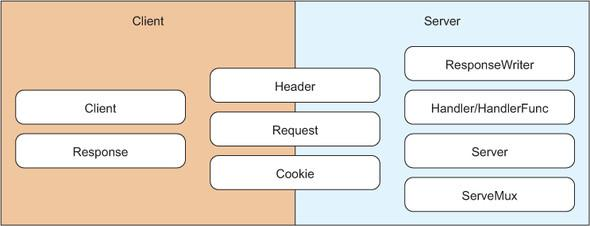
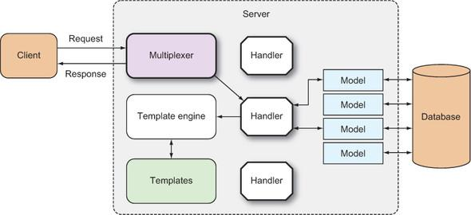
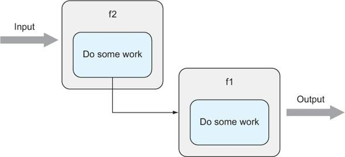
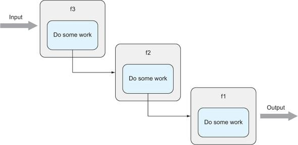
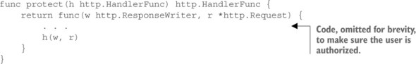
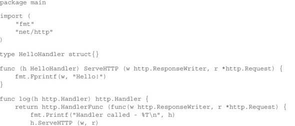
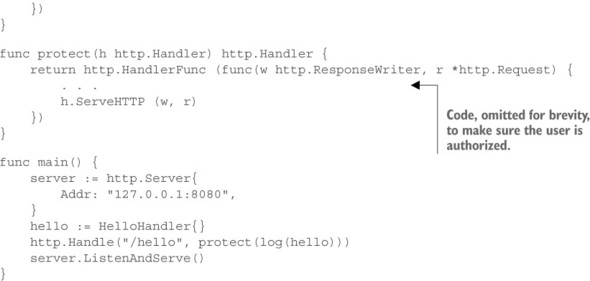
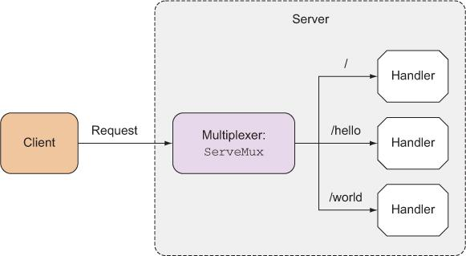
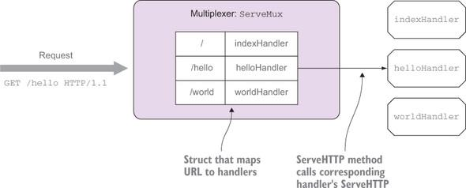

# Capítulo 3. Tratamento de solicitações

Este capítulo abrange

- Usando a biblioteca Go net/http
- Servindo HTTP usando a biblioteca Go net/http
- Compreendendo manipuladores e funções de manipuladores
- Trabalhando com multiplexadores

O Capítulo 2 mostrou as etapas para criar um aplicativo web de fórum de internet simples. O capítulo mapeou as várias partes de um aplicativo web Go, e você viu o panorama geral de como um aplicativo web Go é estruturado. Mas há pouca profundidade em cada uma dessas partes. Nos próximos capítulos, vamos nos aprofundar nos detalhes de cada uma dessas partes e explorar em profundidade como elas podem ser reunidas.

Neste e no próximo capítulo, focaremos no cérebro do aplicativo web: os manipuladores que recebem e processam solicitações do cliente. Neste capítulo, você aprenderá como criar um servidor web com Go e, então, passaremos para o tratamento de solicitações do cliente.

## 3.1. A biblioteca Go net/http

Embora usar uma estrutura de aplicativo web madura e sofisticada para escrever aplicativos web seja geralmente fácil e rápido, as mesmas estruturas geralmente impõem suas próprias convenções e padrões. Muitos assumem que essas convenções e padrões são as melhores práticas, mas as melhores práticas têm uma maneira de se transformar em programação cargo cult quando não são entendidas corretamente. Os programadores que seguem essas convenções sem entender por que elas são usadas geralmente as seguem cegamente e as reutilizam quando é desnecessário ou até mesmo prejudicial.

**Programação de culto à carga**

Durante a Segunda Guerra Mundial, as forças aliadas montaram bases aéreas em ilhas do Pacífico para ajudar nos esforços de guerra. Grandes quantidades de suprimentos e equipamentos militares foram lançados de avião para as tropas e ilhéus que apoiavam as tropas, mudando drasticamente suas vidas. Pela primeira vez, os ilhéus viram roupas manufaturadas, comida enlatada e outros produtos. Quando a guerra terminou, as bases foram abandonadas e a carga parou de chegar. Então, os ilhéus fizeram algo muito natural — eles se vestiram como controladores de tráfego aéreo, soldados e marinheiros, acenaram sinais de pouso usando bastões nos campos de aviação e realizaram exercícios de desfile em uma tentativa de fazer com que a carga continuasse caindo de paraquedas dos aviões.

Esses cultistas de carga deram seus nomes à prática de programação de culto de carga. Embora não exatamente acenando sinais de pouso, os programadores de culto de carga copiam e colam código que herdam ou encontram na internet (frequentemente, StackOverflow) sem entender por que funciona, apenas que funciona. Como resultado, eles geralmente não conseguem estender ou fazer alterações no código. Da mesma forma, os programadores de culto de carga geralmente usam frameworks da web sem entender por que o framework usa certos padrões ou convenções, bem como as compensações que estão sendo feitas.

O motivo pelo qual os dados são persistidos como cookies no cliente e sessões no servidor é porque o HTTP é um protocolo sem conexão, e cada chamada para o servidor não tem conhecimento armazenado da chamada anterior. Sem esse entendimento, usar cookies e sessões parece uma maneira complicada de persistir informações entre conexões. Usar uma estrutura para contornar essa complexidade é inteligente porque uma estrutura normalmente esconde a complexidade e apresenta uma interface uniforme para persistência entre conexões. Como resultado, um novo programador simplesmente presumiria que tudo o que é preciso para persistir dados entre conexões é usar essa interface. Essa interface uniforme é baseada nas convenções de uma estrutura específica, no entanto, e tais práticas podem ou não ser consistentes em todas as estruturas. O que é pior, o mesmo nome de interface pode ser usado em diferentes estruturas, com diferentes implementações e nomes diferentes, aumentando a confusão. Isso significa que o aplicativo da web que é desenvolvido agora está vinculado aoestrutura; movê-la para outra estrutura ou mesmo estender o aplicativo ou adicionar novos recursos requer conhecimento profundo da estrutura (ou versões personalizadas da estrutura).

Este livro não é sobre rejeitar frameworks, convenções ou padrões. Um bom framework de aplicativo da web é frequentemente a melhor maneira de construir aplicativos da web escaláveis ​​e robustos rapidamente. Mas é importante entender a infraestrutura de conceitos subjacentes na qual esses frameworks são construídos. No caso da linguagem de programação Go, usar as bibliotecas padrão normalmente significa usar as bibliotecas net/http e html/template. Com o entendimento adequado, fica mais fácil ver por que certas convenções e padrões são o que são. Isso nos ajuda a evitar armadilhas, dá clareza e nos impede de seguir padrões cegamente.

Neste e no próximo capítulo, vamos nos concentrar em net/http; o capítulo 5 aborda html/template.

A biblioteca net/http é dividida em duas partes, com várias estruturas e funções que suportam uma ou ambas (veja a figura 3.1 ):

Figura 3.1. Manipuladores de encadeamento



- Client: Client, Response, Header, Request, Cookie
- Server: Server, ServeMux, Handler/HandleFunc, ResponseWriter, Header, Request, Cookie

Começaremos usando a biblioteca net/http como servidor, e neste capítulo falaremos sobre como o Go manipula solicitações do cliente. No próximo capítulo, continuaremos com a biblioteca net/http, mas focaremos em usá-la para processar a solicitação.

Neste livro, vamos nos concentrar no uso dos recursos de servidor da biblioteca net/http e não de seus recursos de cliente.

## 3.2. Servindo Go

A biblioteca net/http fornece recursos para iniciar um servidor HTTP que manipula solicitações e envia respostas a essas solicitações (veja a figura 3.2). Ela também fornece uma interface para um multiplexador e um multiplexador padrão.

Figura 3.2. Manipulando solicitações com o servidor Go



### 3.2.1. O servidor web Go

Ao contrário da maioria das bibliotecas padrão em outras linguagens de programação, Go fornece um conjunto de bibliotecas para criar um servidor web. Criar um servidor é trivial e pode ser feito com uma chamada para ListenAndServe , com o endereço de rede como o primeiro parâmetro e o manipulador que cuida das solicitações como o segundo parâmetro, conforme mostrado na listagem a seguir. Se o endereço de rede for uma string vazia, o padrão será todas as interfaces de rede na porta 80. Se o parâmetro do manipulador for nil , o multiplexador padrão, DefaultServeMux , será usado.

Listagem 3.1. O servidor web mais simples

```go
package main

import (
     "net/http"
)

func main() {
     http.ListenAndServe("", nil)
}
```

Este servidor simples não permite muita configuração, mas Go também fornece uma estrutura Server que é essencialmente uma configuração de servidor.

Listagem 3.2. Servidor web com configuração adicional

```go
package main

import (
    "net/http"
)

func main() {
    server := http.Server{
        Addr:    "127.0.0.1:8080",
        Handler: nil,
    }
    server.ListenAndServe()
}
```

A listagem a seguir faz quase a mesma coisa que o código anterior, mas agora permite mais configurações. As configurações incluem definir o tempo limite para ler a solicitação e escrever a resposta e definir um registrador de erros para a estrutura Server .

Listagem 3.3. A configuração da estrutura Server

```go
type Server struct {
    Addr           string
    Handler        Handler
    ReadTimeout    time.Duration
    WriteTimeout   time.Duration
    MaxHeaderBytes int
    TLSConfig      *tls.Config
    TLSNextProto   map[string]func(*Server, *tls.Conn, Handler)
    ConnState      func(net.Conn, ConnState)
    ErrorLog       *log.Logger
}
```
### 3.2.2. Servindo através de HTTPS

A maioria dos principais sites usa HTTPS para criptografar e proteger as comunicações entre o cliente e o servidor quando informações confidenciais, como senhas e informações de cartão de crédito, são compartilhadas. Em alguns casos, essa proteção é obrigatória. Se você aceita pagamentos com cartão de crédito, precisa estar em conformidade com o Payment Card Industry (PCI) Data Security Standard e, para estar em conformidade, precisa criptografar as comunicações entre o cliente e o servidor. Alguns sites, como Gmail e Facebook, usam HTTPS em todo o site. Se você estiver planejando executar um site que exija que o usuário faça login, precisará usar HTTPS.

HTTPS nada mais é do que colocar HTTP em cima de SSL (na verdade, Transport Security Layer [TLS]). Para servir nosso aplicativo web simples por meio de HTTPS, usaremos a função ListenAndServeTLS , mostrada na listagem 3.4 .

SSL, TLS e HTTPS

SSL (Secure Socket Layer) é um protocolo que fornece criptografia de dados e autenticação entre duas partes, geralmente um cliente e um servidor, usando Public Key Infrastructure (PKI). O SSL foi originalmente desenvolvido pela Netscape e mais tarde foi assumido pela Internet Engineering Task Force (IETF), que o renomeou como TLS. HTTPS, ou HTTP sobre SSL, é essencialmente apenas isso — HTTP sobreposto a uma conexão SSL/TLS.

Um certificado SSL/TLS (usarei o termo certificado SSL, pois é mais amplamente conhecido) é usado para fornecer criptografia e autenticação de dados. Um certificado SSL é um pedaço de dados formatado em X.509 que contém algumas informações, bem como uma chave pública, armazenada em um servidor web. Os certificados SSL geralmente são assinados por uma autoridade de certificação (CA), que garante a autenticidade do certificado. Quando o cliente faz uma solicitação ao servidor, ele retorna com o certificado. Se o cliente estiver satisfeito que o certificado é autêntico, ele gerará uma chave aleatória e usará o certificado (ou mais especificamente a chave pública no certificado) para criptografá-lo. Esta chave simétrica é a chave real usada para criptografar os dados entre o cliente e o servidor.

Listagem 3.4. Servindo via HTTPS

```go
package main

import (
    "net/http"
)

func main() {
    server := http.Server{
        Addr:    "127.0.0.1:8080",
        Handler: nil,
    }
    server.ListenAndServeTLS("cert.pem", "key.pem")
}
```
Na listagem anterior, o arquivo cert.pem é o certificado SSL , enquanto key.pem é a chave privada para o servidor. Em um cenário de produção, você precisará obter o certificado SSL de uma CA como VeriSign, Thawte ou Comodo SSL. Mas se você precisar de um certificado e uma chave privada apenas para testar as coisas, você pode gerar seus próprios certificados. Há muitas maneiras de gerá-los, incluindo o uso de bibliotecas padrão Go, principalmente no grupo de bibliotecas crypto.

Embora você não os use (o certificado e a chave privada criados aqui) em um servidor de produção, é útil entender como um certificado SSL e uma chave privada podem ser gerados para fins de desenvolvimento e teste. Esta listagem mostra como podemos fazer isso.

Listagem 3.5. Gerando seu próprio certificado SSL e chave privada do servidor

```go
package main

import (
    "crypto/rand"
    "crypto/rsa"
    "crypto/x509"
    "crypto/x509/pkix"
    "encoding/pem"
    "math/big"
    "net"
    "os"
    "time"
)

func main() {
    max := new(big.Int).Lsh(big.NewInt(1), 128)
    serialNumber, _ := rand.Int(rand.Reader, max)
    subject := pkix.Name{
        Organization:       []string{"Manning Publications Co."},
        OrganizationalUnit: []string{"Books"},
        CommonName:         "Go Web Programming",
    }

    template := x509.Certificate{
        SerialNumber: serialNumber,
        Subject:      subject,
        NotBefore:    time.Now(),
        NotAfter:     time.Now().Add(365 * 24 * time.Hour),
        KeyUsage:     x509.KeyUsageKeyEncipherment | x509.KeyUsageDigitalSignature,
        ExtKeyUsage:  []x509.ExtKeyUsage{x509.ExtKeyUsageServerAuth},
        IPAddresses:  []net.IP{net.ParseIP("127.0.0.1")},
    }
    pk, _ := rsa.GenerateKey(rand.Reader, 2048)
    derBytes, _ := x509.CreateCertificate(rand.Reader, &template,
       &template, &pk.PublicKey, pk)
    certOut, _ := os.Create("cert.pem")
    pem.Encode(certOut, &pem.Block{Type: "CERTIFICATE", Bytes: derBytes})
    certOut.Close()
    keyOut, _ := os.Create("key.pem")
    pem.Encode(keyOut, &pem.Block{Type: "RSA PRIVATE KEY", Bytes:
       x509.MarshalPKCS1PrivateKey(pk)})
    keyOut.Close()
}
```

Gerar o certificado SSL e a chave privada é relativamente fácil. Um certificado SSL é essencialmente um certificado X.509 com o uso de chave estendida definido para autenticação de servidor, então usaremos a biblioteca crypto/x509 para criar o certificado. A chave privada é necessária para criar o certificado, então simplesmente pegamos a chave privada que criamos para o certificado e a salvamos em um arquivo para o arquivo de chave privada do servidor.

Vamos analisar o código. Primeiro, precisamos ter uma struct Certificate , que nos permite definir a configuração para nosso certificado:

    template := x509.Certificate{
      SerialNumber: serialNumber,
      Subject: subject,
      NotBefore: time.Now(),
      NotAfter:  time.Now().Add(365*24*time.Hour),
      KeyUsage: x509.KeyUsageKeyEncipherment | x509.KeyUsageDigitalSignature,
      ExtKeyUsage: []x509.ExtKeyUsage{x509.ExtKeyUsageServerAuth},
      IPAddresses: []net.IP{net.ParseIP("127.0.0.1")},
    }

Precisamos de um número de série de certificado, que é um número exclusivo emitido pela CA. Para nossos propósitos, é bom o suficiente usar um inteiro muito grande que é gerado aleatoriamente. Em seguida, criamos o nome distinto e o configuramos como o assunto para o certificado, e também configuramos o período de validade para durar um ano a partir do dia em que o certificado é criado. Os campos KeyUsage e ExtKeyUsage são usados ​​para indicar que este certificado X.509 é usado para autenticação do servidor. Finalmente, configuramos o certificado para ser executado somente a partir do IP 127.0.0.1.

Certificados SSL

X.509 é um padrão ITU-T (International Telecommunication Union Telecommunication Standardization Sector) para uma Infraestrutura de Chave Pública (PKI). X.509 inclui formatos padrão para certificados de chave pública.

Um certificado X.509 (também chamado coloquialmente de certificado SSL) é um documento digital expresso em ASN.1 (Abstract Syntax Notation One) que foi codificado. ASN.1 é um padrão e notação que descreve regras e estruturas para representar dados em telecomunicações e redes de computadores.

Os certificados X.509 podem ser codificados em vários formatos, incluindo BER (Basic Encoding Rules). O formato BER especifica um formato autodescritivo e autodelimitador para codificar estruturas de dados ASN.1. DER é um subconjunto de BER, fornecendo exatamente uma maneira de codificar um valor ASN.1, e é amplamente usado em criptografia, especialmente certificados X.509.

Em SSL, os certificados podem ser salvos em arquivos de diferentes formatos. Um deles é o PEM (Privacy Enhanced Email, que não tem muita relevância aqui, exceto como o nome do formato de arquivo usado), que é um certificado DER X.509 codificado em Base64, entre “-----BEGIN CERTIFICATE-----” e “-----END CERTIFICATE-----”.

Em seguida, precisamos gerar uma chave privada. Usamos a biblioteca crypto/rsa e chamamos a função GenerateKey para criar uma chave privada RSA:

    pk, _ := rsa.GenerateKey(rand.Reader, 2048)

A estrutura de chave privada RSA criada tem uma chave pública que podemos acessar, útil quando usamos a função x509.CreateCertificate para criar nosso certificado SSL:

    derBytes, _ := x509.CreateCertificate(rand.Reader, &template, &template, &pk.PublicKey, pk)

A função CreateCertificate pega uma série de parâmetros, incluindo a estrutura Certificate e as chaves pública e privada, para criar uma fatia de bytes formatados em DER. O resto é relativamente simples: usamos a biblioteca encoding/pem para codificar o certificado no arquivo cert.pem:

    certOut, _ := os.Create("cert.pem")
    pem.Encode(certOut, &pem.Block{Type: "CERTIFICATE", Bytes: derBytes})
    certOut.Clo()

Também codificamos PEM e salvamos a chave que geramos anteriormente no arquivo key.pem:

    keyOut, _ := os.Create("key.pem")
    pem.Encode(keyOut, &pem.Block{Type: "RSA PRIVATE KEY", Bytes: x509.MarshalPKCS1PrivateKey(pk)})
    keyOut.Close()

Observe que se o certificado for assinado por uma CA, o arquivo de certificado deverá ser a concatenação do certificado do servidor seguido pelo certificado da CA.

## 3.3. Manipuladores e funções de manipuladores

Iniciar um servidor é fácil, mas não faz nada. Se você acessar o servidor, receberá apenas um código de resposta HTTP 404. O multiplexador padrão que será usado se o parâmetro handler for nil não consegue encontrar nenhum handler (porque não escrevemos nenhum) e responderá com o 404. Para fazer qualquer trabalho, precisamos ter handlers.

### 3.3.1. Tratamento de solicitações

Então, o que exatamente é um manipulador? Falamos brevemente sobre manipuladores e funções de manipulador nos capítulos 1 e 2 , então vamos elaborar aqui. Em Go, um manipulador é uma interface que tem um método chamado ServeHTTP com dois parâmetros: uma interface HTTPResponseWriter e um ponteiro para uma struct Request . Em outras palavras, qualquer coisa que tenha um método chamado ServeHTTP com esta assinatura de método é um manipulador:

ServeHTTP(http.ResponseWriter, *http.Request)
Deixe-me divagar e responder a uma pergunta que pode ter ocorrido a você enquanto lia este capítulo. Se o segundo parâmetro para ListenAndServe é um manipulador, então por que o valor padrão é um multiplexador, DefaultServeMux ?

Isso porque ServeMux (que é uma instância de DefaultServeMux ) tem um método chamado ServeHTTP com a mesma assinatura! Em outras palavras, um ServeMux também é uma instância da estrutura Handler . DefaultServeMux é uma instância de ServeMux , então também é uma instância da estrutura Handler . É um tipo especial de manipulador, no entanto, porque a única coisa que ele faz é redirecionar suas solicitações para diferentes manipuladores, dependendo da URL fornecida. Se usarmos um manipulador em vez do multiplexador padrão, poderemos responder, conforme mostrado nesta listagem.

Listagem 3.6. Manipulando requisições

```go
package main

import (
    "fmt"
    "net/http"
)

type MyHandler struct{}

func (h *MyHandler) ServeHTTP(w http.ResponseWriter, r *http.Request) {
    fmt.Fprintf(w, "Hello World!")
}

func main() {
    handler := MyHandler{}
    server := http.Server{
        Addr:    "127.0.0.1:8080",
        Handler: &handler,
    }
    server.ListenAndServe()
}
```

Agora vamos iniciar o servidor (se você não tiver certeza de como fazer isso, vá para a seção 2.7 ). Se você acessar http://localhost:8080 no seu navegador, verá Hello World!

Aqui está a parte complicada: se você for para http://localhost:8080/anything/at/all você ainda obterá a mesma resposta! Por que isso é assim deve ser bem óbvio. Nós apenas criamos um manipulador e o anexamos ao nosso servidor, então não estamos mais usando nenhum multiplexador. Isso significa que não há mais nenhuma correspondência de URL para rotear a solicitação para um manipulador específico, então todas as solicitações que vão para o servidor irão para esse manipulador.

Em nosso manipulador, o método ServeHTTP faz todo o processamento. Ele não faz nada, exceto retornar Hello World!, então é isso que ele faz para todas as solicitações no servidor.

Esta é a razão pela qual normalmente usaríamos um multiplexador. Na maioria das vezes, queremos que o servidor responda a mais de uma solicitação, dependendo da URL da solicitação. Naturalmente, se você estiver escrevendo um servidor muito especializado para um propósito muito especializado, simplesmente criar um manipulador fará o trabalho maravilhosamente.

### 3.3.2. Mais manipuladores

Na maioria das vezes, não queremos ter um único manipulador para lidar com todas as solicitações como na listagem 3.6 ; em vez disso, queremos usar diferentes manipuladores para diferentes URLs. Parafaça isso, não especificamos o campo Handler na estrutura Server (o que significa que ele usará o DefaultServeMux como o manipulador); usamos a função http.Handle para anexar um manipulador ao DefaultServeMux . Observe que algumas das funções como Handle são funções para o pacote http e também métodos para ServeMux . Essas funções são, na verdade, funções de conveniência; chamá-las simplesmente chama as funções correspondentes do DefaultServeMux . Se você chamar http.Handle , estará, na verdade, chamando o método Handle do DefaultServeMux .

Na listagem a seguir, criamos dois manipuladores e então anexamos o manipulador à respectiva URL. Se você for para http://localhost:8080/hello, você obterá Hello!, enquanto que se você for para http://localhost:8080/world, você obterá World!.

Listagem 3.7. Manipulando requisições com múltiplos manipuladores

```go
package main

import (
    "fmt"
    "net/http"
)

type HelloHandler struct{}

func (h *HelloHandler) ServeHTTP (w http.ResponseWriter, r *http.Request) {
    fmt.Fprintf(w, "Hello!")
}

type WorldHandler struct{}

func (h *WorldHandler) ServeHTTP (w http.ResponseWriter, r *http.Request) {
    fmt.Fprintf(w, "World!")
}

func main() {
    hello := HelloHandler{}
    world := WorldHandler{}

    server := http.Server{
        Addr: "127.0.0.1:8080",
    }
    http.Handle("/hello", &hello)
    http.Handle("/world", &world)
    server.ListenAndServe()
}
```

### 3.3.3. Funções do manipulador

Falamos sobre manipuladores, mas o que são funções de manipulador? Funções de manipulador são funções que se comportam como manipuladores. Funções de manipulador têm a mesma assinatura que o método ServeHTTP ; ou seja, elas aceitam um ResponseWriter e um ponteiro para um Request . A listagem a seguir mostra como isso funciona com nosso servidor.

Listagem 3.8. Manipulando requisições com funções handler

```go
package main

import (
    "fmt"
    "net/http"
)

func hello(w http.ResponseWriter, r *http.Request) {
    fmt.Fprintf(w, "Hello!")
}

func world(w http.ResponseWriter, r *http.Request) {
    fmt.Fprintf(w, "World!")
}

func main() {
    server := http.Server{
        Addr: "127.0.0.1:8080",
    }
    http.HandleFunc("/hello", hello)
    http.HandleFunc("/world", world)
    server.ListenAndServe()
}
```

Como isso funciona? Go tem um tipo de função chamado HandlerFunc , que adaptará uma função f com a assinatura apropriada em um Handler com um método f . Por exemplo, pegue a função hello :

```go
func hello(w http.ResponseWriter, r *http.Request) {
      fmt.Fprintf(w, "Hello!")
}
```

Se fizermos isso:

    helloHandler := HandlerFunc(hello)

então helloHandler se torna um Handler. Confuso? Vamos voltar ao nosso servidor anterior, que aceita handlers.

```go
type MyHandler struct{}

func (h *MyHandler) ServeHTTP (w http.ResponseWriter, r *http.Request) {
    fmt.Fprintf(w, "Hello World!")
}

func main() {
    handler := MyHandler{}
    server := http.Server{
        Addr:    "127.0.0.1:8080",
        Handler: &handler,
    }
    server.ListenAndServe()
}
```

A linha que registra a função hello na URL /hello é

    http.Handle("/hello", &hello)

Isso nos mostra como a função Handle registra um ponteiro para um Handler para uma URL. Para simplificar as coisas, a função HandleFunc converte a função hello em um Handler e a registra em DefaultServeMux . Em outras palavras, as funções handler são meramente maneiras convenientes de criar handlers. A listagem a seguir mostra o código para a função http.HandleFunc .

Listagem 3.9. Código fonte http.HandleFunc

```go
func HandleFunc(pattern string, handler func(ResponseWriter, *Request)) {
     DefaultServeMux.HandleFunc(pattern, handler)
}
```

Aqui está o código-fonte da função HandleFunc :

```go
func (mux *ServeMux) HandleFunc(pattern string, handler func(ResponseWriter, *Request)) {
    mux.Handle(pattern, HandlerFunc(handler))
}
```

Observe que handler, uma função, é convertida em um manipulador real por HandlerFunc.

Como usar funções de manipulador é mais limpo e faz o trabalho tão bem, por que usar manipuladores? Tudo se resume ao design. Se você tem uma interface existente ou se quer um tipo que também pode ser usado como um manipulador, basta adicionar um método ServeHTTP a essa interface e você obterá um manipulador que pode atribuir a uma URL. Ele também pode permitir que você crie aplicativos da web que sejam mais modulares.

### 3.3.4. Encadeamento de manipuladores e funções de manipuladores

Embora Go não seja considerada uma linguagem funcional, ela tem alguns recursos que são comuns a linguagens funcionais, incluindo tipos de função, funções anônimas e fechamentos. Como você notou antes, passamos uma função para outra função e nos referimos a uma função nomeada por seu identificador. Isso significa que podemos passar uma função f1 para outra função f2 para f2 fazer seu processamento e, então, chamar f1 (veja a figura 3.3 ).

Figura 3.3. Manipuladores de encadeamento



Vamos trabalhar em um exemplo. Digamos que toda vez que chamamos um manipulador queremos registrá-lo em algum lugar que ele foi chamado. Podemos sempre adicionar esse código no manipulador, ou podemos refatorar uma função utilitária (como fizemos no capítulo 2 ) que pode ser chamada por todas as funções. Fazer isso pode ser intrusivo, no entanto; geralmente queremos que nosso manipulador contenha lógica para processar apenas a solicitação.

O registro, juntamente com uma série de funções semelhantes, como segurança e tratamento de erros, é o que é comumente conhecido como cross-cutting concern . Essas funções são comuns e queremos evitar adicioná-las em todos os lugares, o que causa duplicação de código e dependências. Uma maneira comum de separar claramente cross-cutting concerns de sua outra lógica é o encadeamento . Esta listagem mostra como podemos encadear manipuladores.

Listagem 3.10. Encadeando duas funções handler

```go
package main

import (
    "fmt"
    "net/http"
    "reflect"
    "runtime"
)

func hello(w http.ResponseWriter, r *http.Request) {
    fmt.Fprintf(w, "Hello!")
}

func log(h http.HandlerFunc) http.HandlerFunc {
    return func(w http.ResponseWriter, r *http.Request) {
        name := runtime.FuncForPC(reflect.ValueOf(h).Pointer()).Name()
        fmt.Println("Handler function called - " + name)
        h(w, r)
    }
}

func main() {
    server := http.Server{
        Addr: "127.0.0.1:8080",
    }
    http.HandleFunc("/hello", log(hello))
    server.ListenAndServe()
}
```

Temos nossa função de manipulador hello usual . Também temos uma função de log , que recebe um HandlerFunc e retorna um HandlerFunc . Lembre-se de que hello é um HandlerFunc , então isso envia a função hello para a função log ; em outras palavras, ele encadeia as funções log e hello .

    log(hello)

A função log retorna uma função anônima que recebe um ResponseWriter e um ponteiro para um Request , o que significa que a função anônima é um HandlerFunc . Dentro da função anônima, imprimimos o nome do HandlerFunc (nesse caso, é main.hello ) e então o chamamos. Como resultado, obteremos hello! no navegador e uma declaração impressa no console que diz isto:

    Handler function called – main.hello

Naturalmente, se pudermos encadear duas funções de manipulador, podemos encadear mais. O mesmo princípio nos permite empilhar manipuladores para executar múltiplas ações, como peças de Lego. Isso às vezes é chamado de processamento de pipeline (veja a figura 3.4 ).

Figura 3.4. Encadeando mais manipuladores



Digamos que temos outra função chamada protect , que verifica a autorização do usuário antes de executar o manipulador:



Então, para usar protect , simplesmente os encadeamos:

    http.HandleFunc("/hello", protect(log(hello)))

Você pode ter notado que, embora eu tenha mencionado anteriormente que estamos encadeando manipuladores, o código na listagem 3.10 na verdade mostra funções de manipulador de encadeamento. Os mecanismos para manipuladores de encadeamento e funções de manipulador são muito semelhantes, como mostrado a seguir.

Listagem 3.11. Encadeando manipuladores




Vamos ver o que é diferente. Temos nosso HelloHandler de antes, que é o último manipulador na cadeia, como antes. A função log , em vez de receber um HandlerFunc e retornar um HandlerFunc , recebe um Handler e retorna um Handler :

```go
func log(h http.Handler) http.Handler {

    return http.HandlerFunc (func(w http.ResponseWriter, r *http.Request) {

        fmt.Printf("Handler called - %T\n", h)

        h.ServeHTTP (w, r)

    })

}
```

Em vez de retornar uma função anônima, agora adaptamos essa função anônima usando HandlerFunc , que, se você se lembra de antes, retorna um Handler . Além disso, em vez de executar a função handler, agora pegamos o handler e chamamos sua função ServeHTTP . Todo o resto permanece basicamente o mesmo, exceto que em vez de registrar uma função handler, registramos o handler:

    hello := HelloHandler{}
    http.Handle("/hello", protect(log(hello)))

Encadear manipuladores ou funções de manipulador é uma expressão comum que você encontrará em muitas estruturas de aplicativos da web.

### 3.3.5. ServeMux e DefaultServeMux


Discutimos ServeMux e DefaultServeMux anteriormente neste capítulo e no capítulo anterior. ServeMux é um multiplexador de requisição HTTP. Ele aceita uma requisição HTTP e a redireciona para o manipulador correto de acordo com a URL na requisição, ilustrada na figura 3.5 .

Figura 3.5. Multiplexação de solicitações para manipuladores



ServeMux é uma struct com um mapa de entradas que mapeiam uma URL para um manipulador. Também é um manipulador porque tem um método ServeHTTP . O método ServeHTTP do ServeMux encontra a URL que mais se aproxima da solicitada e chama o ServeHTTP do manipulador correspondente (veja a figura 3.6 ).

Figura 3.6. Dentro de um multiplexador



Então o que é DefaultServeMux ? ServeMux não é uma interface, então DefaultServeMux não é uma implementação de ServeMux . DefaultServeMux é uma instância de ServeMux que épublicamente disponível para o aplicativo que importa a biblioteca net/http. É também a instância do ServeMux que é usada quando nenhum manipulador é fornecido para a estrutura Server .

Dando um passo para trás, você também perceberá que o ServeMux também é outra abordagem para encadear manipuladores, porque o ServeMux é um manipulador.

Nestes exemplos, a URL solicitada /hello combina perfeitamente com a URL registrada no multiplexador. O que acontece se chamarmos a URL /random? Ou se chamarmos a URL /hello/there?

Tudo depende de como registramos as URLs. Se registrarmos a URL raiz (/) como na figura 3.6 , quaisquer URLs que não coincidam cairão na hierarquia e pousarão na URL raiz. Se agora chamarmos /random e não tivermos o manipulador para essa URL, o manipulador da URL raiz (nesse caso indexHandler) será chamado.

Que tal /hello/there então? O Princípio da Menor Surpresa ditaria que, como temos a URL /hello registrada, deveríamos usar como padrão essa URL e helloHandler deveria ser chamado. Mas na figura 3.6 , indexHandler é chamado em vez disso. Por que isso acontece?

**O Princípio da Menor Surpresa**

O Princípio da Menor Surpresa, também conhecido como Princípio do Menor Espanto, é um princípio geral no design de todas as coisas (incluindo software) que diz que, ao projetar, devemos fazer a coisa menos surpreendente. Os resultados de fazer algo devem ser óbvios, consistentes e previsíveis.

Se colocarmos um botão ao lado de uma porta, esperaríamos que o botão fizesse algo com a porta (tocar a campainha ou abrir a porta). Se o botão desligasse as luzes do corredor, isso seria contra o Princípio da Menor Surpresa, porque ele estaria fazendo algo que um usuário daquele botão não esperaria.

O motivo é porque registramos o helloHandler na URL /hello em vez de /hello/. Para quaisquer URLs registradas que não terminem com uma barra (/), o ServeMux tentará corresponder ao padrão exato da URL. Se a URL terminar com uma barra (/), o ServeMux verá se a URL solicitada começa com alguma URL registrada.

Se tivéssemos registrado a URL /hello/ em vez disso, então quando /hello/there for solicitado, se o ServeMux não puder encontrar uma correspondência exata, ele começará a procurar por URLs que começam com /hello/. Há uma correspondência, então helloHandler será chamado.

### 3.3.6. Outros multiplexadores

Como o que é preciso para ser um manipulador ou mesmo um multiplexador é implementar o ServeHTTP , é possível criar multiplexadores alternativos ao ServeMux do net/http . Com certeza, vários multiplexadores de terceiros estão disponíveis, incluindo o excelente Gorilla Toolkit ( www.gorillatoolkit.org ). O Gorilla Toolkit tem dois multiplexadores diferentes que funcionam de forma bem diferente: mux e pat. Nesta seção, veremos um multiplexador de terceiros leve, mas eficaz, chamado HttpRouter.


Uma das principais reclamações sobre o ServeMux é que ele não suporta variáveis ​​em sua correspondência de padrões contra a URL. O ServeMux manipula /threads muito bem para recuperar e exibir todos os tópicos no fórum, mas é difícil manipular /thread/123 para recuperar e exibir o tópico com id 123. Para processar tais URLs, seu manipulador precisará analisar o caminho da solicitação e extrair as seções relevantes. Além disso, devido à maneira como o ServeMux faz a correspondência de padrões para as URLs, você não pode usar algo como /thread/123/post/456 se quiser recuperar o post com id 456 do tópico com id 123 (pelo menos não com muita complexidade de análise desnecessária).

A biblioteca HttpRouter supera algumas dessas limitações. Nesta seção, exploraremos alguns dos recursos mais importantes desta biblioteca, mas você sempre pode consultar o restante da documentação em https://github.com/julienschmidt/httprouter . Esta listagem mostra uma implementação usando HttpRouter.

Listagem 3.12. Usando HttpRouter

```go
package main

import (
    "fmt"
    "github.com/julienschmidt/httprouter"
    "net/http"
)

func hello(w http.ResponseWriter, r *http.Request, p httprouter.Params) {
    fmt.Fprintf(w, "hello, %s!\n", p.ByName("name"))
}

func main() {
    mux := httprouter.New()
    mux.GET("/hello/:name", hello)
    server := http.Server{
        Addr:    "127.0.0.1:8080",
        Handler: mux,
    }
    server.ListenAndServe()
}
```

A maior parte do código deve parecer familiar para você agora. Criamos o multiplexador chamando a função New .

    mux := httprouter.New()

Em vez de usar HandleFunc para registrar as funções do manipulador, usamos os nomes dos métodos:

    mux.GET("/hello/:name", hello)

Neste caso, estamos registrando uma URL para o método GET para a função hello . Se enviarmos uma solicitação GET, a função hello será chamada; se enviarmos qualquer outro HTTPsolicitações que não serão. Observe que a URL agora tem algo chamado parâmetro nomeado . Esses parâmetros nomeados podem ser substituídos por quaisquer valores e podem ser recuperados mais tarde pelo manipulador.

    func hello(w http.ResponseWriter, r *http.Request, p httprouter.Params) {
         fmt.Fprintf(w, "hello, %s!\n", p.ByName("name"))
    }

A função handler também mudou; em vez de pegar dois parâmetros, agora pegamos um terceiro, um tipo Params . Params contém os parâmetros nomeados, que podemos recuperar usando o método ByName .

Por fim, em vez de usar DefaultServeMux , passamos nosso multiplexador para a estrutura Server e deixamos Go usá-lo:

    server := http.Server{
        Addr:    "127.0.0.1:8080",
        Handler: mux,
    }
    server.ListenAndServe()

Mas espere. Como exatamente incluímos a biblioteca de terceiros? Se fizermos o que fizemos para os outros exemplos e executarmos go build no console, obteremos algo assim:

    $ go build

    server.go:5:5: cannot find package "github.com/julienschmidt/httprouter" in any of:

        /usr/local/go/src/github.com/julienschmidt/httprouter (from $GOROOT)

        /Users/sausheong/gws/src/github.com/julienschmidt/httprouter (from $GOPATH)

Um sistema de gerenciamento de pacotes simples é um dos pontos fortes do Go. Precisamos simplesmente executar

    $ go get github.com/julienschmidt/httprouter

at the console and if we’re connected to the internet, it’ll download the code from the HttpRouter repository (in GitHub) and store it in the $GOPATH/src directory. Then when we run go build , it’ll import the code and compile our server.

## 3.4. Using HTTP/2

Before leaving this chapter, let me show you how you can use HTTP/2 in Go with what you have learned in this chapter.

In chapter 1 , you learned about HTTP/2 and how Go 1.6 includes HTTP/2 by default when you start up a server with HTTPS. For older versions of Go, you can enable this manually through the golang.org/x/net/http2 package.

If you’re using a Go version prior to 1.6, the http2 package is not installed by default, so you need to get it using go get:

    go get "golang.org/x/net/http2"

Modify the code from listing 3.6 by importing the http2 package and also adding a line to set up the server to use HTTP/2.

In the following listing you can see by calling the ConfigureServer method in the http2 package, and passing it the server configuration, you have set up the server to run in HTTP/2.

Listing 3.13. Using HTTP/2

```go
package main

import (
    "fmt"
    "golang.org/x/net/http2"
    "net/http"
)

type MyHandler struct{}

func (h *MyHandler) ServeHTTP (w http.ResponseWriter, r *http.Request) {
    fmt.Fprintf(w, "Hello World!")
}

func main() {
    handler := MyHandler{}
    server := http.Server{
        Addr:    "127.0.0.1:8080",
        Handler: &handler,
    }
     http2.ConfigureServer(&server, &http2.Server{})
    server.ListenAndServeTLS("cert.pem", "key.pem")
}
```

Now, run the server:

    go run server.go

To check whether the server is running in HTTP/2, you can use cURL. You will be using cURL quite a bit in this book, because it’s widely available on most platforms, so it’s a good time to get familiar with it.

CURL

Curl is a command-line tool that allows users to get or send files through a URL. It supports a large number of common internet protocols, including HTTP and HTTPS. cURL is installed by default in many variants of Unix, including OS X, but is also available in Windows. To download and install cURL manually, go to http://curl.haxx.se/download.html .

Starting from version 7.43.0, cURL supports HTTP/2. You can perform a request using the HTTP/2 protocol passing the --http2 flag. To use cURL with HTTP/2, you need to link it to nghttp2, a C library that provides support for HTTP/2. As of this writing, many default cURL implementations don’t yet support HTTP/2 (including the one shipped with OS X), so if you need to recompile cURL, link it with nghttp2 and replace the previous cURL version with the one you just built.

Once you have done that, you can use cURL to check your HTTP/2 web application:

    curl -I --http2 --insecure https://localhost:8080/

Remember, you need to run it against HTTPS. Because you created your own certificate and private key, by default cURL will not proceed as it will try to verify the certificate. To force cURL to accept your certificate, you need to set the insecure flag.

You should get an output similar to this:

    HTTP/2.0 200
    content-type:text/plain; charset=utf-8
    content-length:12
    date:Mon, 15 Feb 2016 05:33:01 GMT

We’ve discussed how to handle requests, but we mostly glossed over how to process the incoming request and send responses to the client. Handlers and handler functions are the key to writing web applications in Go, but processing requests and sending responses is the real reason why web applications exist. In the next chapter, we’ll turn to the details on requests and responses and you’ll see how to extract information from requests and pass on information through responses.

## 3.5. Summary

- Go has full-fledged standard libraries for building web applications, with net/http and html/template.
- Although using good web frameworks is often easier and saves time, it is important to learn the basics of web programming before using them.
- Go’s net/http package allows HTTP to be layered on top of SSL to be more secured, creating HTTPS.
- Go handlers can be any struct that has a method named ServeHTTP with two parameters: an HTTPResponseWriter interface and a pointer to a Request struct.
- Handler functions are functions that behave like handlers. Handler functions have the same signature as the ServeHTTP method and are used to process requests.
- Handlers and handler functions can be chained to allow modular processing of requests through separation of concerns.
- Multiplexers are also handlers. ServeMux is an HTTP request multiplexer. It accepts an HTTP request and redirects it to the correct handler according to the URL in the request
DefaultServeMux is a publicly available instance of ServeMux that is used as the default multiplexer.
- In Go 1.6 and later, net/http supports HTTP/2 by default. Before 1.6, HTTP/2 support can be added manually by using the http2 package.
